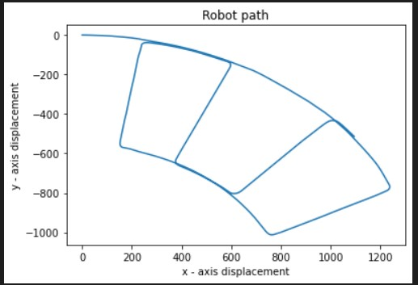
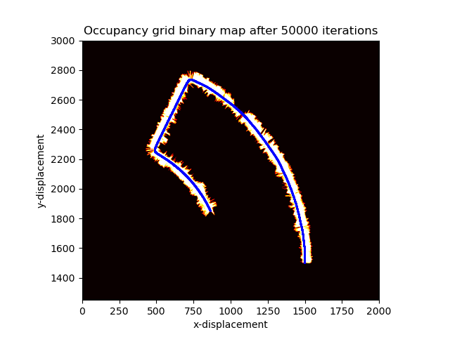
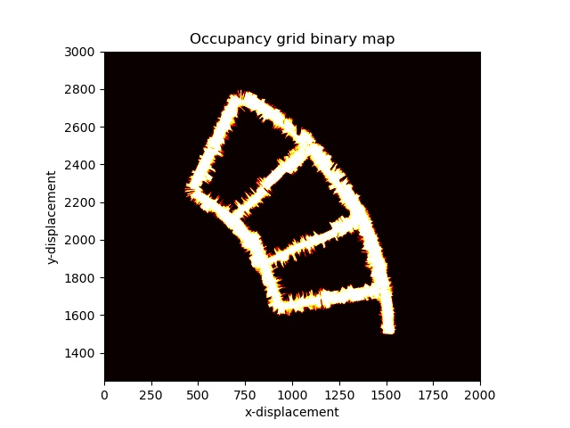

# Particle_Filter_SLAM
Robotics systems perceive their environments through sensors and manipulate their environment through things that move. In designing these systems, one must consider the different kinds of uncertainties such as dynamic and unpredictable environments, noisy sensors, inaccurate actuators and motors, imperfect computational models and many such nondeterministic factors. As robots move more towards autonomy space, there would be more emphasis on real time software systems, and thus this makes SLAM a critical problem in robotics. 

This project was aimed at implementing simultaneous localization and mapping (SLAM) using odometry, 2-D LiDAR scans and stereo camera measurements from an autonomous car. The IMU and Encoder data of the autonomous car were used to estimate the next state of the robot using a differential-drive motion model. Using particle filters, the localization of the ego car was predicted and updated. An occupancy grid map was generated, and robot’s position updated using lidar readings and scan-grid correlation observation model.

## Implementation

The main.py consists of following functions:

- lv_encoder: computes the linear velocity of the ego car and adds gaussian white noise
- w_fog: computes the angular velocity of of the ego car and adds gaussian white noise
- read_data_from_csv: function to read data from .csv files; seperates data and timestamps
- motion_moodel: Input (linear velocity, angular velocity, timestamps) & Output (Next state)
- bresenham2D: computes the coordinates between the start point and end point of ray
- mapCorrelation: find map correlation b/w 2 grids
- lidar_in_world: convert lidar (polar coordinate data) to world frame
- sigmoid: returns the sigmoid values of a given input
- log_odds: compute and return the modified log-odds map

The main code body contains the prediction and update step of particle filter

## Results

   
 

